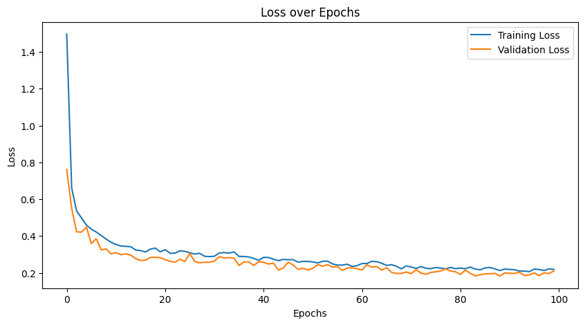
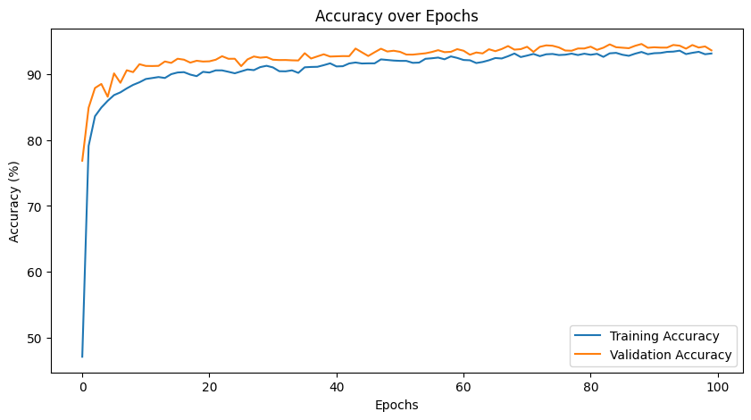

# quant-net
This repository holds the code and description used to train a quantized spiking neural network with straing through estimator technique

 This repository is dedicated to various techniques to train and quantize spiking neural networks . This repository holds a series of projects related to the quantization and trainign algorithms for spiking neural networks. The following are the projects in this repository :

 ## Quant net version 1.0
   This project describes a dense spiking neural network for MNIST data classification trainind using strainght through estimator technique the weights of the model is being quantized betwwen -8 and 8 range with 64 levels . The architecture consis of 4 dense layers and a dropout ;ayer trained for 10 time steps and for 100 epochs . The loss and accuracy curves with respect to epochs are as shown below 

### Loss curve

### Accuracy curve

